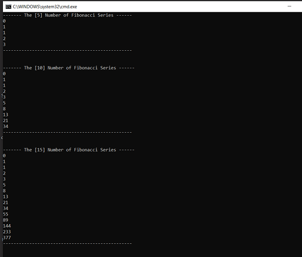
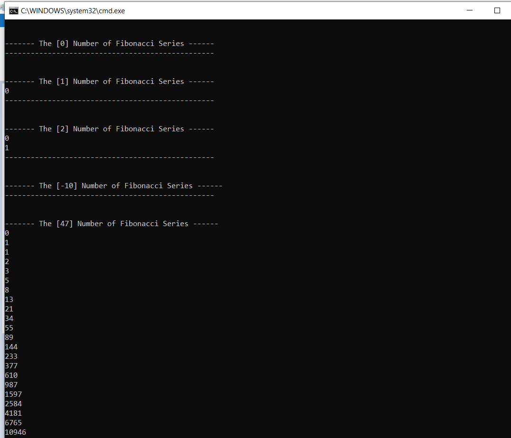
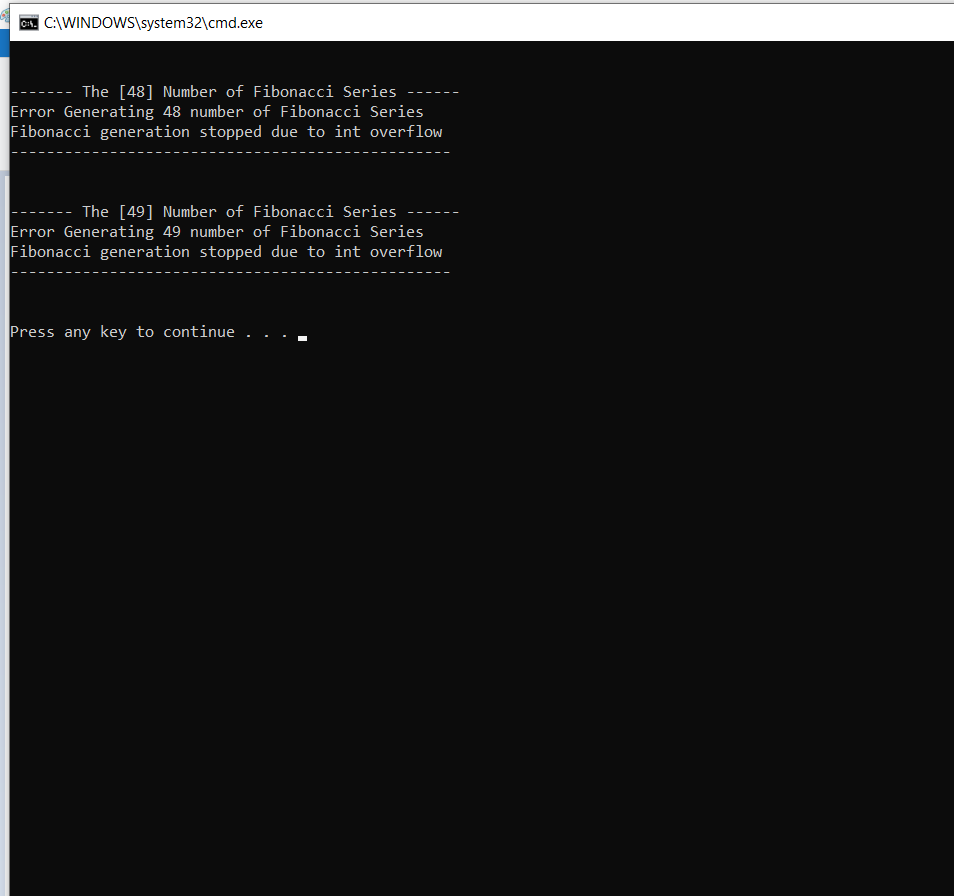

## Fibonacci Series Example

**Problem Statement**

Given integer N, write a program to generate Fibonacci series with N entries.

**Example Details**
- FibonacciSeries.cs - Routine to generate Fibonacci series
- TestFinonacci.cs - Functions to test Fibonacci routine 

**Example Output**

